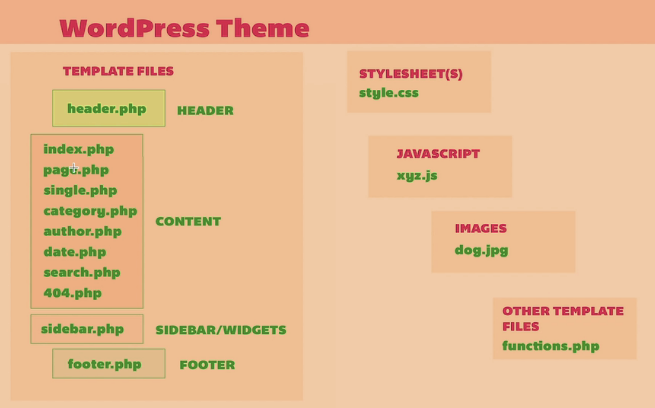

#Wordpress Twenty-Nineteen Child Theme

## Building a child theme

This is an explorative project to create a totally customized child theme based on the built-in Wordpress theme Twentynineteen.

A child theme is a theme based on an existing theme. All the CSS and functionality of the child theme comes from the parent theme. If there is an update on the parent theme, **ALL** of your changes would be lost. So you create a child theme to protect your project from unwanted changes.

A theme in Wordpress is a folder present in the Wordpress/wp_content/themes that includes a file `style.csss` and a file `index.php`. The `style.css` must start with a comment text  
`/*  Theme Name: Twenty Nineteen Child */`

I used a "blank" child template I got from `childthemewp.com`. You can get all the files structures ready to be customized.

To override the parent theme, you must specifically copy the file from the parent theme into your child folder and make the changes you want. On the PHP code section, it means that you have to find the function you want in the parent code, and  copy that into your child folder. The main functions are saves in the files `functions.php`. if you want to change things in the footer, you copy the file `footer.php` into your child theme folder, and pay attention to the folder location.

The CSS is also very complicated, as you have to create new classes to apply your styles, you also  have to check the current classes and copy them into your new style.css file.

The developer tools on Chrome (and also on Firefox) make that task easier. You right-click the element you want to modify,  and select `inspect`. The developer tool will open inside your browser (you can also press `option` + `command` + `i` on a mac in Chrome) with the element HTML highlighted. On the styles panel you will have the current settings applied (and nt applied) onto the HTML. You can also modify the parameters or add new ones, and see the changes live on the browser. If you like what you see, you can copy the CSS from the browser into your code.

Here is a reference to how Wordpress organizes it's theme files:

Make all the changes and copy the folder of your child theme out of the Wordpress and compress the folder as a backup for future use.

